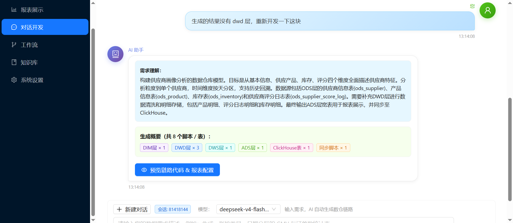
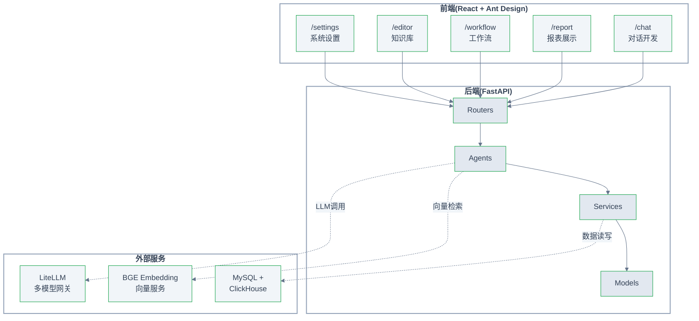
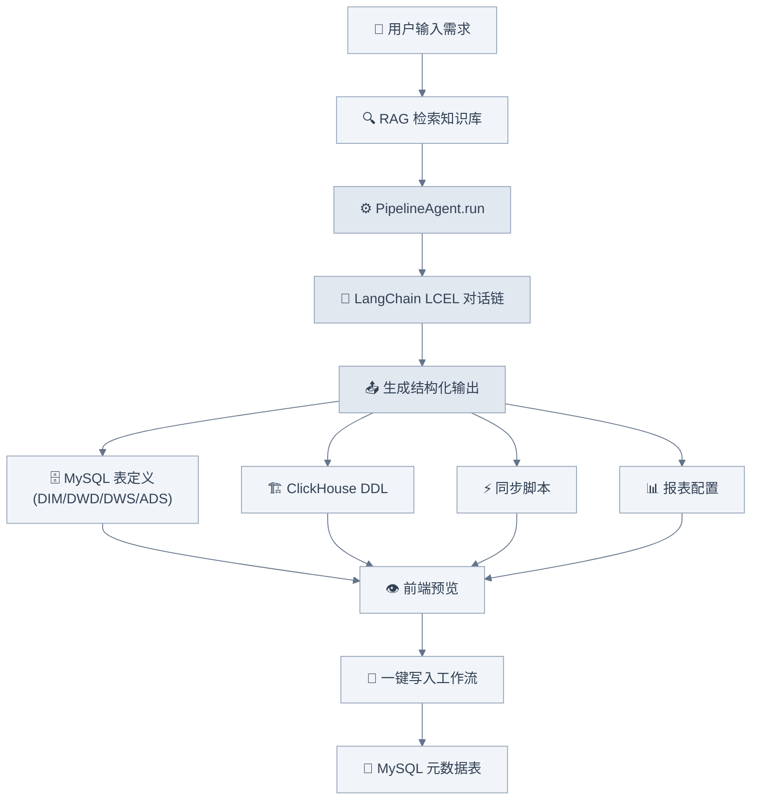
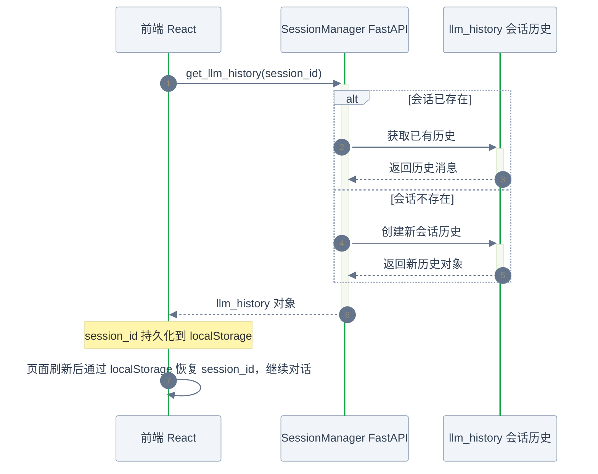

# Report Agent

> 🚀 基于大语言模型的一站式数据开发平台：用自然语言描述需求，自动生成数仓链路（ODS → DIM → DWD → DWS → ADS → ClickHouse）、报表配置与可运行脚本。



---

## ✨ 核心功能

| 模块 | 功能描述 |
|:---------|:---------|
| 对话开发 | 基于 LangChain 的多轮对话，LLM 自动生成完整数仓链路（MySQL 建表 + ClickHouse DDL + 同步脚本 + 报表配置） |
| 报表展示 | 查看已生成的报表列表，支持按类目分类，查询报表元信息、字段与图表配置 |
| 工作流 | 脚本分组管理、脚本运行调度、运行日志回溯、数据源配置 |
| 知识库 | 结构化文档的 RAG 检索，支持文本/文件导入、语义搜索、文档统计 |
| 系统设置 | 基础配置管理 |

## 🏗️ 技术架构



### 技术栈详情

**后端**
- **Python 3.10+** / **FastAPI** — 异步 Web 框架
- **LangChain** + **LCEL** — 对话链与智能编排（`RunnableWithMessageHistory`）
- **LiteLLM** — 多模型网关，统一调用 OpenAI / Azure / DeepSeek 等
- **BGE (sentence-transformers)** — 本地向量嵌入，支持 RAG
- **MySQL** — 元数据存储（工作流、脚本、报表配置）
- **ClickHouse** — 业务数据存储与查询

**前端**
- **React 18** + **TypeScript**
- **Vite** — 构建工具
- **Ant Design 5** — UI 组件库
- **AntV G2Plot / S2** — 图表与透视表
- **React Router** — 路由管理
- **Zustand** — 轻量状态管理

---

## 📁 项目结构

```
auto_report_generate/
├── backend/                          # 后端服务
│   ├── app/
│   │   ├── agents/                   # Agent 层（业务逻辑编排）
│   │   │   ├── base_agent.py         # Agent 基类
│   │   │   ├── pipeline_agent.py     # 数仓链路生成 Agent
│   │   │   ├── intent_parser.py      # 意图解析 Agent
│   │   │   ├── sql_generator.py      # SQL 生成 Agent
│   │   │   ├── report_builder.py     # 报表生成 Agent
│   │   │   └── quality_checker.py    # 质量检查 Agent
│   │   ├── core/                     # 核心模块
│   │   │   ├── config.py             # 配置管理
│   │   │   ├── langchain_llm.py      # LLM 调用（LCEL 对话链）
│   │   │   ├── litellm_client.py     # LiteLLM 客户端封装
│   │   │   ├── session_manager.py    # 会话管理（memory 持久化）
│   │   │   └── embedding_service.py  # 向量嵌入服务
│   │   ├── models/                   # Pydantic 数据模型
│   │   │   └── schemas.py
│   │   ├── prompts/                  # Prompt 模板
│   │   │   ├── pipeline_prompt.py    # 数仓链路生成 prompt
│   │   │   └── prompt_templates.py
│   │   ├── routers/                  # API 路由
│   │   │   ├── chat.py               # 对话开发 API
│   │   │   ├── report_api.py         # 报表管理 API
│   │   │   ├── workflow.py           # 工作流 API
│   │   │   ├── knowledge.py          # 知识库 API
│   │   │   ├── etl.py                # ETL 任务 API
│   │   │   ├── query.py              # 查询执行 API
│   │   │   ├── report.py             # 报表生成 API
│   │   │   └── clickhouse.py         # ClickHouse 操作 API
│   │   ├── services/                 # 业务服务层
│   │   │   ├── mysql_service.py      # MySQL 元数据服务
│   │   │   ├── clickhouse_service.py # ClickHouse 服务
│   │   │   ├── knowledge_rag.py      # RAG 检索服务
│   │   │   ├── dataworks_service.py  # DataWorks 集成
│   │   │   └── script_runner.py      # 脚本运行器
│   │   └── main.py                   # FastAPI 入口
│   ├── config/                       # 配置文件
│   │   ├── litellm-config.yaml
│   │   ├── clickhouse-config.yaml
│   │   └── dataworks-config.yaml
│   └── Dockerfile
│
├── frontend/                         # 前端应用
│   ├── src/
│   │   ├── components/layout/        # 布局组件
│   │   │   └── MainLayout.tsx        # 主布局（侧边栏 + 内容区）
│   │   ├── pages/                    # 页面
│   │   │   ├── Dashboard.tsx         # 对话开发（核心页面）
│   │   │   ├── Report.tsx            # 报表展示
│   │   │   ├── Workflow.tsx          # 工作流管理
│   │   │   ├── Editor.tsx            # 知识库管理
│   │   │   └── Settings.tsx          # 系统设置
│   │   ├── services/api.ts           # API 请求封装
│   │   ├── App.tsx                   # 路由配置
│   │   ├── main.tsx                  # 应用入口
│   │   └── index.css
│   ├── index.html
│   ├── package.json
│   ├── tsconfig.json
│   └── vite.config.ts
│
└── servers/                          # 独立辅助服务
    └── embedding_server.py            # BGE 本地向量服务
```

---

## 🧠 核心设计

### 对话开发流程



### 会话管理设计



---

## 🚀 快速开始

### 1. 环境变量

创建 `backend/.env` 文件：

```env
# LiteLLM 模型网关
LITELLM_BASE_URL=http://localhost:4000
LITELLM_API_KEY=your-api-key
LITELLM_MODEL=deepseek-chat

# BGE Embedding
EMBEDDING_BASE_URL=http://localhost:8001
EMBEDDING_MODEL=bge-m3

# MySQL
MYSQL_HOST=localhost
MYSQL_PORT=3306
MYSQL_USER=root
MYSQL_PASSWORD=your-password
MYSQL_DATABASE=auto_etl

# ClickHouse
CLICKHOUSE_HOST=localhost
CLICKHOUSE_PORT=8123
CLICKHOUSE_USER=default
CLICKHOUSE_PASSWORD=
CLICKHOUSE_DATABASE=default
```

### 2. 启动后端

```bash
cd backend
pip install -r requirements.txt  # 首次安装依赖
uvicorn app.main:app --reload --port 8000
```

### 3. 启动向量嵌入服务（可选，用于 RAG）

```bash
cd servers
python embedding_server.py
```

### 4. 启动前端

```bash
cd frontend
npm install
npm run dev
```

访问 http://localhost:5173 → 自动跳转到 `/report` 报表首页。进入 `/chat` 即可开始对话开发。

---

## 📡 API 概览

| 路由前缀 | 标签 | 核心接口 |
|---------|------|---------|
| `/api/v1/chat` | 对话开发 | `POST /pipeline` 生成数仓链路、`POST /persist` 写入工作流、会话 CRUD |
| `/api/v1/reports` | 报表 | 报表 CRUD、字段/图表管理、`POST /query` 执行查询 |
| `/api/v1/workflow` | 工作流 | 目录管理、脚本管理、`POST /scripts/{id}/run` 运行 |
| `/api/v1/knowledge` | 知识库 | 文本/文件导入、语义搜索、文档管理 |
| `/api/v1/etl` | ETL | `POST /generate` 生成 ETL 任务 |
| `/api/v1/query` | 查询 | `POST /execute` 执行查询 |
| `/api/v1/clickhouse` | ClickHouse | 库/表浏览、采样、统计 |

完整 API 文档：启动后端后访问 **http://localhost:8000/docs** (Swagger UI)。

---

## 🔧 代码规范

| 语言 | 规范 |
|-----|------|
| Python | PEP 8，类型注解必选，docstring Google 风格，统一 `structlog` 日志 |
| TypeScript | 严格模式，接口 `I` 前缀，Zustand 全局状态 |
| SQL | 分层命名 `ods_`/`dwd_`/`dws_`/`ads_`，分区字段必含 `dt` |

详见 [project-rules.md](./.trae/rules/project-rules.md)。

---

## 📖 开发指南

### 添加一个新 Agent

1. 在 `backend/app/agents/` 下创建新文件，继承 `BaseAgent`
2. 在 `backend/app/prompts/` 添加对应 prompt 模板
3. 在 `backend/app/routers/` 中注册 API 路由

### 添加一个新前端页面

1. 在 `frontend/src/pages/` 创建页面组件
2. 在 `frontend/src/App.tsx` 添加路由
3. 在 `frontend/src/components/layout/MainLayout.tsx` 添加菜单项

---

## 📄 License

MIT License
